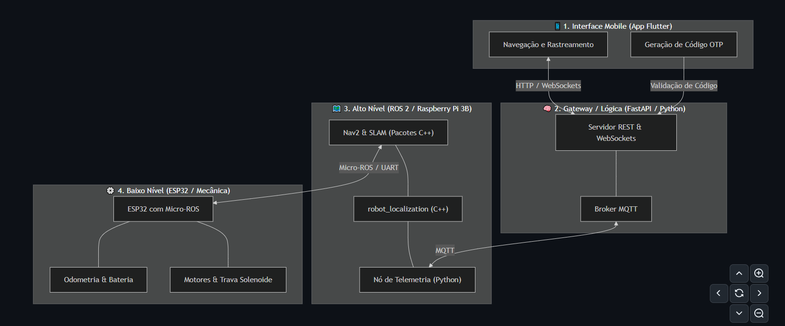

# 🤖 UnBot Delivery: Sistema de Logística Autônoma UnB

 
*Placeholder para o Banner do Projeto: Sugestão de imagem com o logo do UnBot e as cores UnB Navy e Glow Green.*

O **UnBot Delivery** é uma solução avançada de logística *last-mile* desenvolvida para o campus da Universidade de Brasília (UnB). O sistema integra tecnologias móveis, backend escalável e hardware ciber-físico para permitir entregas autônomas e seguras.

---

## 🏗️ Arquitetura do Sistema

O projeto opera em uma arquitetura distribuída e assíncrona, composta por quatro pilares fundamentais:

| Entidade | Tecnologia | Função |
| :--- | :--- | :--- |
| **App Mobile** | Flutter | Interface do usuário e gerenciamento de pedidos via `ValueNotifier`. |
| **Gateway** | FastAPI (Python) | Orquestrador lógico, segurança OTP e ponte de dados. |
| **Broker** | Mosquitto MQTT | Barramento de mensageria de baixa latência para comunicação com hardware. |
| **Robô** | ESP32 / ROS 2 | Atuador físico, telemetria e interface ciber-física. |


*Diagrama de Fluxo de Dados e Controle do UnBot Delivery.*

---

## 🚀 Guia de Setup e Execução

### 📋 Pré-requisitos
* **Flutter SDK (3.27+)**
* **Python 3.10+**
* **Mosquitto MQTT Broker**
* **VS Code** (Extensões: Flutter, Dart, Python)

### 🛠️ Passo a Passo para Desenvolvimento

1.  **Inicialize o Broker MQTT:**
    ```bash
    net start mosquitto
    ```
2.  **Inicie o Backend Gateway:**
    Navegue até `/backend_gateway` e execute:
    ```bash
    pip install fastapi uvicorn paho-mqtt python-dotenv
    uvicorn main:app --host 0.0.0.0 --port 8000 --reload
    ```
3.  **Configure o Túnel (Dev Tunnels):**
    No VS Code, encaminhe a porta `8000`, mude para **Public** e cole o link gerado no `api_service.dart`.
4.  **Simule o Robô (Heartbeat):**
    Para habilitar o despacho no App, envie o sinal de vida do robô via PowerShell:
    ```bash
    & 'C:\Program Files\mosquitto\mosquitto_pub.exe' -t "robot/status/heartbeat" -m "{\"status\": \"online\"}"
    ```
5.  **Rode o App:**
    ```bash
    flutter pub get
    flutter run
    ```

---

## 🔐 Lógica Técnica e Segurança

### Gerenciamento de Estado
Utilizamos o padrão **Observer** com `ValueListenableBuilder` para garantir que a interface seja reativa a múltiplos pedidos simultâneos sem perda de performance.

### Protocolo Peek-and-Consume (OTP)
A segurança da retirada baseia-se em um segredo criptográfico gerado via `secrets` (Python). O código só é validado após o Broker confirmar a entrega da mensagem MQTT ao hardware, garantindo a transacionalidade da entrega física.

---

## 📦 Distribuição (Build do APK)

Para gerar o executável de produção para Android, siga o procedimento de **Clean Build** para evitar corrupção de artefatos:

```bash
# 1. Limpeza profunda de cache
flutter clean

# 2. Reconstrução de dependências
flutter pub get

# 3. Compilação Ahead-of-Time (AOT)
flutter build apk --release
```

**⚠️ Importante:** O artefato final será gerado em `build/app/outputs/flutter-apk/app-release.apk`. Certifique-se de que o `AndroidManifest.xml` contenha as permissões de `INTERNET` e `usesCleartextTraffic="true"` para garantir a conectividade em modo Release.

---

## 📊 Estado Atual (Kanban)


*Visão geral do progresso técnico e backlog do projeto.*

* ✅ **Multi-Pedido:** Suporte a N pedidos ativos.
* ✅ **Setup Dev Tunnels:** Integração mobile-local estável.
* 🟡 **Identidade Visual:** Unificação UnB Navy/Glow Green (Em progresso).
* 🚀 **Hardware:** Integração do Firmware ESP32 (Próximo marco).

---

## 🎓 Créditos
Projeto desenvolvido como parte do **PIT (Projeto Integrador)** da **Faculdade de Tecnologia (FT)** - Engenharia Mecatrônica - Universidade de Brasília (UnB).

