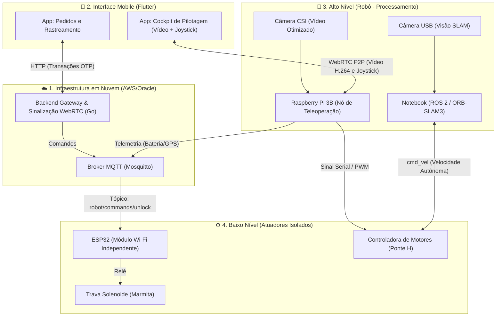

# 🤖 UnBot Delivery: Sistema de Logística Autônoma UnB


O **UnBot Delivery** é uma solução avançada de logística *last-mile* desenvolvida para o campus da Universidade de Brasília (UnB). O sistema integra tecnologias móveis, backend em nuvem e hardware ciber-físico distribuído, permitindo navegação autônoma com suporte a teleoperação de contingência em tempo real.

---

## 🏗️ Arquitetura do Sistema (V2.0 - Teleoperação e Nuvem)

O projeto evoluiu para uma arquitetura distribuída e tolerante a falhas. Separamos a camada de navegação pesada da camada de atuação crítica, utilizando cinco pilares fundamentais:

| Entidade | Tecnologia | Função |
| :--- | :--- | :--- |
| **App Mobile** | Flutter | UI de pedidos, rastreamento reativo e "Cockpit" de teleoperação (Joystick e Vídeo). |
| **Gateway (Nuvem)** | Go (Golang) / Pion | Servidor de alta performance para validação OTP e sinalização WebRTC. |
| **Broker (Nuvem)** | Mosquitto MQTT | Barramento seguro de baixa latência para comandos transacionais. |
| **Cérebro (Robô)** | Notebook + ROS 2 | Processamento de Visão Computacional (ORB-SLAM3) e Navegação Autônoma. |
| **Reflexos (Robô)**| RPi 3B + ESP32 | RPi para streaming de vídeo (WebRTC); ESP32 isolado para atuação da trava (MQTT). |

### 🗺️ Topologia de Rede e Dados



---

## 🚀 Guia de Setup e Integração

### 📋 Pré-requisitos
* **Flutter SDK (3.27+)**
* **Go (Golang 1.21+)** para o Backend V2.
* **Ambiente Nuvem:** Instância EC2/Oracle com portas 1883 (MQTT) e 8080 (API) expostas.
* **VS Code / PlatformIO** para o firmware do ESP32 em C++.

### 🛠️ Passos de Execução (Fase de Transição)

1.  **Subir a Infraestrutura na Nuvem:**
    O Mosquitto e o Gateway em Go devem ser executados no servidor remoto para evitar que o notebook local atue como ponto único de falha.
2.  **Firmware ESP32 (Trava de Segurança):**
    O ESP32 deve ser programado com credenciais Wi-Fi (ou 4G do robô) e se subscrever ao tópico do Mosquitto na nuvem. *Nota: A trava operará de forma 100% independente do Raspberry Pi.*
3.  **Configuração do WebRTC (Raspberry Pi):**
    Conectar a Pi Camera Module (CSI). Iniciar o nó em Python/Go no Raspberry que aguarda a sinalização P2P para iniciar a transmissão de vídeo acelerada por hardware (H.264).
4.  **Execução do App Mobile:**
```bash
flutter clean
flutter pub get
flutter run
'''

---

## 🔐 Lógica Técnica e Segurança Transacional

### Isolamento de Falhas (Fail-Safe)
A arquitetura foi desenhada para garantir a integridade da entrega. O comando de abertura da trava viaja via MQTT da nuvem diretamente para o ESP32. Se o sistema de navegação (Notebook/ROS 2) falhar ou o robô colidir, o usuário ainda poderá utilizar o código OTP no aplicativo para resgatar sua marmita física.

### Protocolo Peek-and-Consume (OTP)
A senha criptográfica só é marcada como "usada" no banco de dados do Backend (Go) após o Broker MQTT confirmar a entrega da mensagem de acionamento ao microcontrolador ESP32.

### Teleoperação de Baixa Latência
Para auxiliar o robô em travessias complexas (como faixas de pedestres), o aplicativo estabelece uma ponte *Peer-to-Peer* com o Raspberry Pi via **WebRTC**. Os comandos do joystick virtual são enviados por *DataChannels* contornando o servidor, resultando em tempo de resposta em milissegundos.

---

## 📦 Distribuição (Build do APK)

Para gerar o executável de produção para Android, siga o procedimento de **Clean Build** para evitar corrupção de artefatos:

'''bash
# 1. Limpeza profunda de cache
flutter clean

# 2. Reconstrução de dependências
flutter pub get

# 3. Compilação Ahead-of-Time (AOT)
flutter build apk --release
'''

**⚠️ Importante:** O artefato final será gerado em `build/app/outputs/flutter-apk/app-release.apk`. Certifique-se de que o `AndroidManifest.xml` contenha as permissões de `INTERNET` e `usesCleartextTraffic="true"` para garantir a conectividade em modo Release.

---

## 📊 Estado Atual (Kanban de Sprints)


*Visão geral do progresso técnico e backlog do projeto.*

| Sprint | Foco | Status |
| :--- | :--- | :--- |
| **V1.0** | App Base, Gateway Local, Multi-Pedido | ✅ Concluído |
| **V2.0 - Sprint 1** | Migração Go, Nuvem MQTT, Firmware Trava ESP32 | 🟡 Em Andamento |
| **V2.0 - Sprint 2** | WebRTC Raspberry Pi, Joystick Mobile e Vídeo | ⏳ Na Fila |

---

## 🎓 Créditos e Equipe
Projeto desenvolvido como parte do **Projeto Integrador de Tecnologias (PIT)** da **Faculdade de Tecnologia (FT)** - Engenharia Mecatrônica - Universidade de Brasília (UnB). 

*Equipe distribuída entre as disciplinas de:*
* Interface Mobile & Backend
* Visão Computacional & Navegação Autônoma
* Sistemas Embarcados & Eletrônica