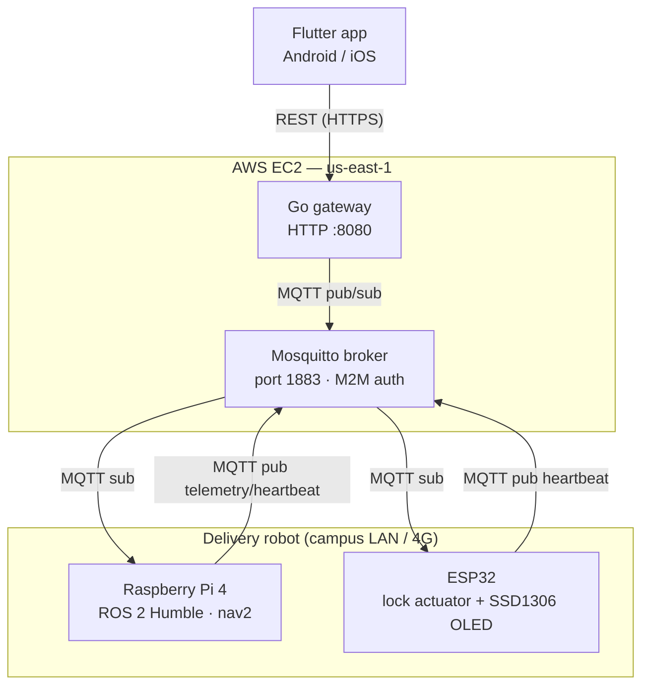

# UnBot Delivery — System Architecture

## Monorepo topology

```
unbot/
├── mobile/          # Flutter client app (Dart)
├── gateway/         # Go HTTP + MQTT gateway (cloud VM)
├── hardware/
│   └── esp32-lock/  # C++ firmware (PlatformIO / Arduino)
└── docs/            # This folder
```

The Raspberry Pi / ROS 2 navigation node lives outside the monorepo on the robot itself; it communicates exclusively via MQTT.

---

## Runtime topology



### Node responsibilities

| Node | Runtime | Responsibility |
|---|---|---|
| **Flutter app** | iOS / Android | Order placement, OTP display, QR scanner, order tracking UI |
| **Go gateway** | AWS EC2 (systemd service) | REST API, OTP issuance & validation, MQTT orchestration |
| **Mosquitto** | AWS EC2 (same VM) | Message broker; enforces M2M auth, no anonymous clients |
| **Raspberry Pi** | On-robot | ROS 2 nav2 navigation; subscribes to `robot/commands/navigate` |
| **ESP32** | On-robot (lock module) | Renders QR on OLED, fires solenoid on `robot/commands/unlock` |

### Network constraints

- The robot is behind CGNAT (4G LTE router). The Pi and ESP32 always **initiate outbound** connections to the Mosquitto broker; the gateway never dials the robot directly.
- Campus Wi-Fi is unreliable. The system operates in **OTP-only degraded mode** when the MQTT navigate publish fails — the OTP is still issued and the order proceeds.
- The ESP32 is resource-constrained (240 MHz, 520 KB SRAM). All firmware data structures are stack-allocated. No heap allocation after `setup()`.

---

## Key design decisions

### Go gateway — no framework, stdlib only
`net/http` with Go 1.22 path parameters (`{id}` wildcards). Zero third-party router dependencies. All handlers are thin HTTP↔service translation layers with no business logic.

### OTP store — in-memory, keyed by code
The primary key is the 4-digit code string (not `order_id`) because `ValidateAndUnlock` receives a code and must look it up in O(1). `LookupByOrderID` does a linear scan — acceptable at campus concurrency (~O(10s) concurrent orders).

### Flutter state — `ValueNotifier`, no Provider/Riverpod
Three top-level `ValueNotifier` instances (`activeOrdersNotifier`, `userStateNotifier`, `pastOrdersNotifier`). All mutations go through free-function helpers that swap the `.value` reference atomically. Direct list mutation is forbidden (listeners would not fire).

### ESP32 MFA sequencing — firmware-enforced
The unlock command is silently rejected unless a `display_qr` command for the same `order_id` was received first (`_pendingOrderId` guard). This ensures physical proximity — a customer cannot unlock without the robot being present and the OLED having rendered.
