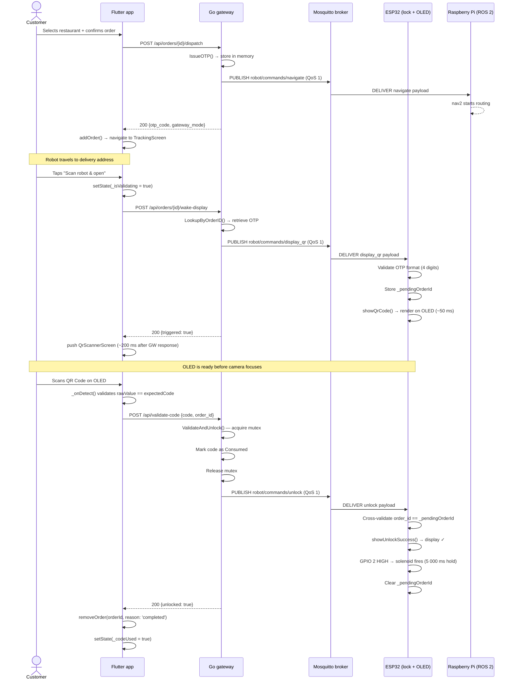
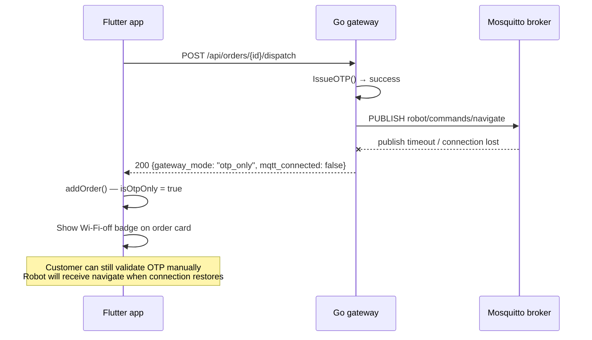
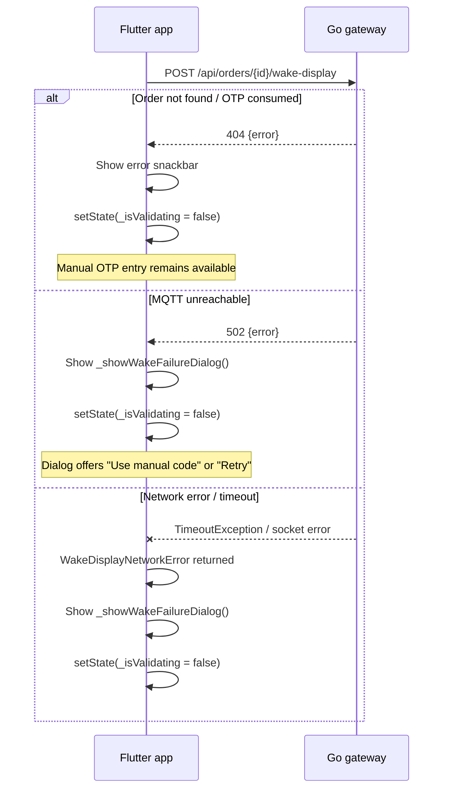
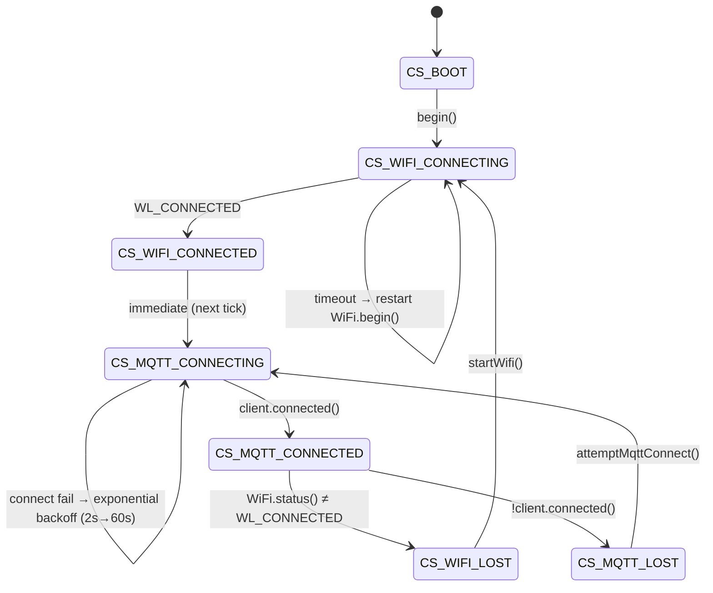

# UnBot Delivery — State Flows & Invariants

## On-demand optical MFA — full sequence

This is the primary delivery sequence introduced in Phase 1.5. The QR Code is rendered lazily (when the customer initiates the scan), not eagerly (at dispatch time).



---

## Degraded mode — MQTT unreachable at dispatch



---

## Wake-display failure paths



---

## Go OTP service — state invariants

```
OTPRecord.Consumed transitions: false → true (one-way, irreversible)

ValidateAndUnlock critical section:
  1. Acquire mu
  2. Look up code → if absent: release mu, return ErrInvalidCode
  3. If Consumed: release mu, return ErrConsumed
  4. Set Consumed = true
  5. Release mu          ← code is consumed before MQTT publish
  6. Publish unlock
  7. If publish fails: return ErrPublish (code already consumed — no replay)

Invariant: a code can open exactly one compartment, regardless of
concurrent requests, MQTT failures, or client retries.
```

---

## ESP32 connection state machine



**Key invariant**: `client.loop()` is called **only** in `CS_MQTT_CONNECTED`. Calling it in any other state reads from a null/stale TCP socket and can trigger a hard fault on ESP-IDF.

---

## Flutter `ValueNotifier` mutation rules

All three global notifiers follow the same immutable-swap protocol:

```
// CORRECT — triggers listeners
activeOrdersNotifier.value = [...current, newOrder];

// WRONG — mutates list in place, listeners DO NOT fire
activeOrdersNotifier.value.add(newOrder);  // ← NEVER DO THIS
```

`removeOrder()` is atomic from the UI's perspective:
1. Find departing order in `activeOrdersNotifier.value`
2. Call `archivePastOrder()` → prepend to `pastOrdersNotifier.value`
3. Write filtered list to `activeOrdersNotifier.value`

Both notifiers fire in the same synchronous call stack. No frame exists where an order is absent from both lists simultaneously.

---

## Active order lifecycle

```
Placement          Tracking           Pickup              Archive
─────────          ────────           ──────              ───────
addOrder()    →    activeOrdersNotifier  →  removeOrder(    →  pastOrdersNotifier
                   isOtpOnly badge          reason: 'completed'   reason badge:
                   TrackingScreen           or 'cancelled')       'Entregue' / 'Cancelado'
```

`reason: 'completed'` is set by `code_screen.dart` (OTP validated).  
`reason: 'cancelled'` is set by the cancel dialog in `tracking_screen.dart`.  
Default parameter on `removeOrder()` is `'completed'` — callers at non-happy-path sites must be **explicit**.
